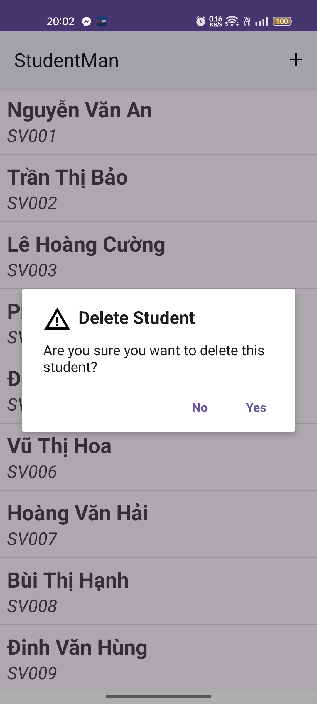

# IT4785 - Developing Mobile Applications

This repository contains demo for a student management app 

## UI Layout Result:

---
## Demo Result:
|    Add Student Activity    |   Update Student Activity   |
|:--------------------------------------------------------------------------------------:|:------------------------------------------------------------------------------------------:|
|   Delete student dialog  |   Delete Student Snackbar  |
| :------------------------------------------------------------------------------------: | :----------------------------------------------------------------------------------------: |
|    Context Menu for items    |      Context Menu for items      |

**Course details:** _Developing Mobile Applications - IT4785 - Hanoi University of Science and Technology._

### _Create by Hoang Minh Hai. Nov 2024_
