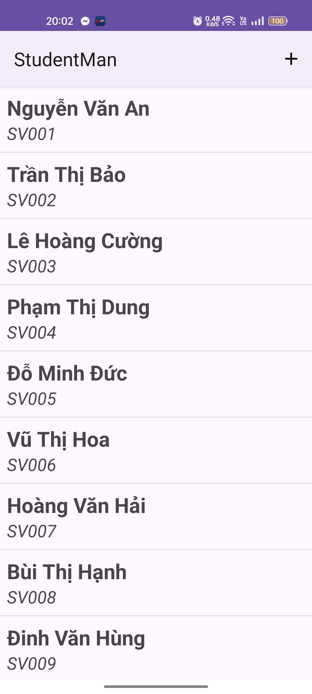
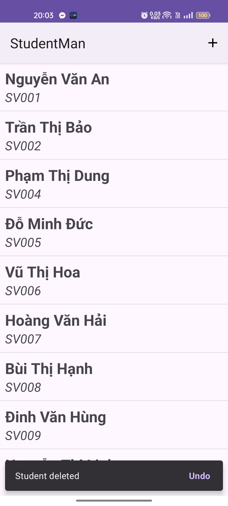

# IT4785 - Developing Mobile Applications

This repository contains demo for a student management app 

## UI Layout Result:

---
## Demo Result:
|        Add Student       |       Update Student      |
|:------------------------------------------------------------------------------------:|:----------------------------------------------------------------------------------------:|
|  Delete student dialog |  Delete Student Snackbar |

**Course details:** _Developing Mobile Applications - IT4785 - Hanoi University of Science and Technology._

### _Create by Hoang Minh Hai. Nov 2024_
